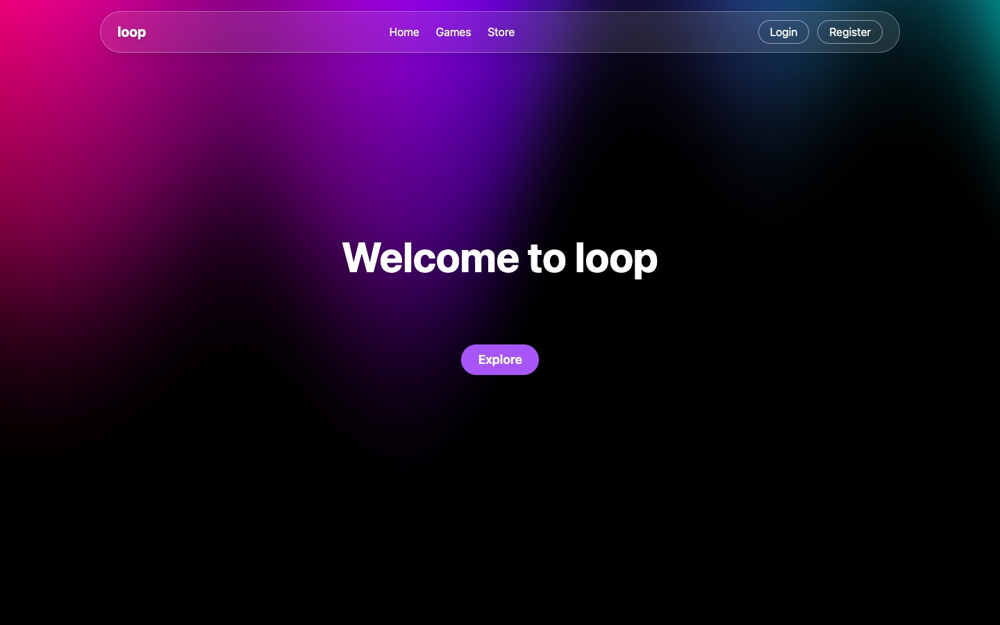
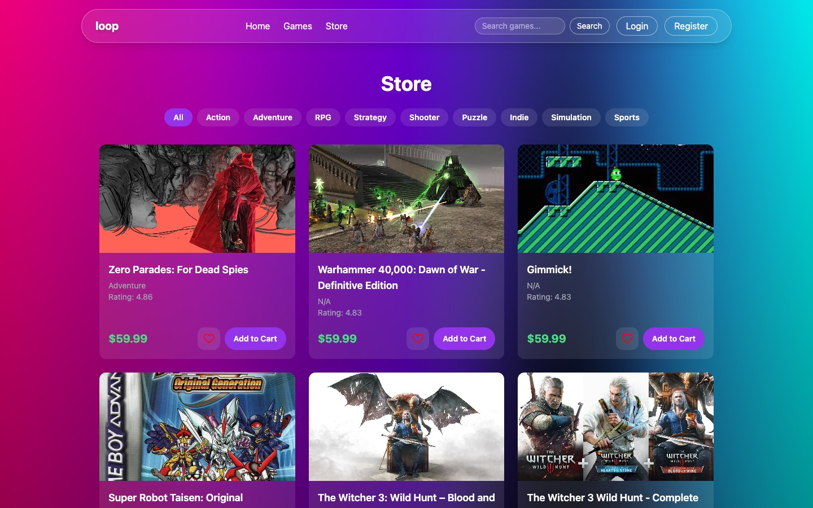
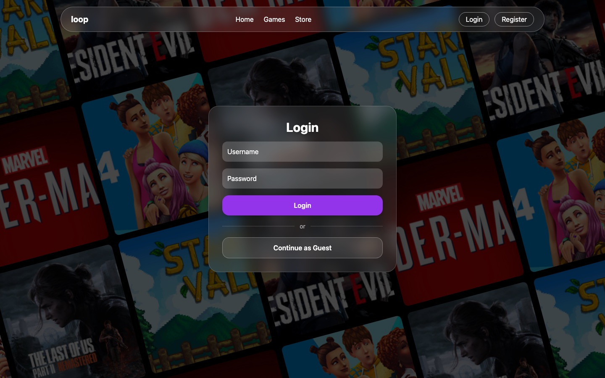

<div align="center">

# Loop

**Your games, organized. Your next favorite, discovered.**

A full-stack gaming hub where you track your game library, wishlist titles, get notified when prices drop, get personalized recommendations, and buy game keys, all in one place.

### [**▶ Live demo**](https://loop-nine-sigma.vercel.app/)

No sign-up needed: click **Continue as Guest** on the login page.


[](https://github.com/jaismin-ks/Loop/actions/workflows/tests.yml)

</div>



---

## About

Gamers usually spread their collection across Steam, Epic, consoles, and a notes app full of "games to play someday." **Loop** brings it all into one place. You keep a library of what you own and where you are in each game, a wishlist that watches prices for you, and recommendations based on what you actually play.

Loop started as our final project for a Python course (Spring 2026). It began as a Flask REST API and grew into a full-stack app with an animated React frontend, a simulated pricing system, a notification system, and a cloud deployment.

| Store | Login |
|-------|-------|
|  |  |

---

## Features

**Library and organization**
- Add games to your library and track their status (*Playing* / *Completed*)
- Group games into custom **playlists** (for example "Co-op with friends" or "Backlog")

**Discovery**
- Browse thousands of games from the [RAWG](https://rawg.io) database, filter by genre, and search by title
- **Personalized recommendations** based on the genres in your library and wishlist

**Wishlist and price tracking**
- Wishlist games and see their current price with full **price history**
- **Check for Sales** runs a price update, and drops trigger a sale badge and a notification

**Store**
- Cart and checkout flow that generates game keys, with order history on your profile

**Notifications**
- A bell in the navbar for **price drops** and **new DLC** for games you own

**Accounts**
- Register, log in, and edit your profile (email, bio, password)
- **Continue as Guest** creates a private throwaway account in one click

> Prices, sales, and game keys are simulated for the project. No real purchases happen.

---

## How It Was Built

### Architecture


Loop is a **React single-page app** that talks to a **Flask REST API**. The API stores user data in a SQL database and pulls game data (titles, art, genres, ratings, DLC) from the **RAWG API**.

- **Frontend:** React 19 with Vite and React Router. Styled with Tailwind CSS and animated with GSAP and Motion. The WebGL backgrounds (Aurora, pixel snow, grid motion) use OGL and Three.js.
- **Backend:** Flask, organized into **blueprints** per feature (`auth`, `games`, `library`, `wishlist`, `playlists`, `orders`, `prices`, `notifications`, `recommendations`). Every write route validates its input first.
- **Database:** SQLite for local development. Postgres ([Neon](https://neon.tech)) in production. A small adapter in `db.py` lets the same SQL run on both.

### Data model


Ten tables: `users`, `library`, `wishlist`, `playlists`, `playlist_games`, `orders`, `order_items`, `prices`, `notifications`, `known_dlc`.

### Interesting parts

**Recommendation engine.** Loop collects every game in your library and wishlist and fetches their genres from RAWG. It ranks the genres by how often they appear, then pulls the top-rated games from your **top 3 genres**. Games you already own or wishlisted are filtered out, and the rest are paginated. The RAWG lookups run in parallel with a thread pool, so the carousel loads quickly.

**Price simulation.** Each game gets a base price from its RAWG rating (from $19.99 up to $59.99). Every "Check for Sales" run gives full-price games a 30% chance to go on sale at 10–50% off. Games already on sale have a 25% chance to return to full price. A new row is written only when the price actually changes, so the history stays clean. Every user who wishlisted a discounted game gets a notification.

**DLC alerts.** The DLC check scans every game in every library for new add-ons on RAWG. It saves each DLC in `known_dlc`, so a user is never notified twice about the same one.

**Guest mode.** Since every feature is tied to a user, **Continue as Guest** creates a real account with a random name like `guest_7f3a9c`. Each visitor gets a private sandbox instead of sharing one guest account with strangers.

### From school project to the web

The project was first built to run locally and with **Docker Compose** (one container for Flask and one for Vite). Putting it online took a few changes:

- **Serverless backend.** On Vercel, the Flask app runs as a single serverless function mounted under `/api` (`api/index.py`). The React build is served as static files on the same domain, so no CORS setup is needed.
- **SQLite to Postgres.** Serverless functions have no permanent disk, so production uses Neon Postgres. Local development still uses a plain SQLite file with zero setup.
- **Security.** Passwords are hashed with scrypt and never sent back to the client. Accounts with older plain-text passwords are upgraded automatically on login.
- **Performance.** The landing-page video shrank from 42 MB to 10 MB, RAWG requests got timeouts and connection reuse, and the slowest endpoint (recommendations) now makes its API calls in parallel.

### Development process

We built Loop in sprints over March–April 2026. The backend and database design (ERD and architecture diagrams) came first, then the core features, then the frontend and extras like recommendations, price simulation, and notifications. Unit tests for all input validators run automatically on every push with **GitHub Actions**.

---

## Tech Stack

| Layer | Tools |
|-------|-------|
| **Frontend** | React 19, Vite, React Router, Tailwind CSS, GSAP, Motion, OGL / Three.js, shadcn/ui, Lucide icons |
| **Backend** | Python, Flask, Flask-CORS, Requests, Werkzeug |
| **Database** | SQLite (local), Postgres on Neon (production), psycopg |
| **External API** | [RAWG Video Games Database](https://rawg.io/apidocs) |
| **DevOps** | Docker and Docker Compose, GitHub Actions, Vercel |

---

## Running Locally

### Prerequisites

- Python 3.11+
- Node.js 20+
- A free RAWG API key from [rawg.io/apidocs](https://rawg.io/apidocs)

### 1. Clone the repo

```bash
git clone https://github.com/jaismin-ks/Loop
cd Loop
```

### 2. Start the backend

```bash
cd backend
pip install -r requirements.txt
```

Create `backend/.env` (see `.env.example`):

```
RAWG_API_KEY=your_rawg_api_key
```

```bash
python3 server.py
```

The API runs on `http://localhost:5001` and creates `backend/loop.db` on first run.

### 3. Start the frontend

In a second terminal:

```bash
cd frontend
npm install
npm run dev
```

Open **http://localhost:5173**.

### Or use Docker

Put the same `.env` file in the project root, then run:

```bash
docker-compose up --build
```

Open **http://127.0.0.1:5173**.

---

## Deploying Your Own Copy

1. Fork this repo and import it on [Vercel](https://vercel.com/new). Choose the **root** of the repo; `vercel.json` handles the build.
2. Add a **Neon** Postgres database from the project's **Storage** tab. This sets `DATABASE_URL`.
3. Add `RAWG_API_KEY` under **Settings → Environment Variables**.
4. Redeploy. Tables are created automatically on the first request.

| Variable | Required | Description |
|----------|----------|-------------|
| `RAWG_API_KEY` | Yes | RAWG API key for game data |
| `DATABASE_URL` | Production | Postgres connection string. If unset, the backend uses SQLite. |
| `VITE_API_URL` | No | Overrides the backend URL. Defaults to `http://127.0.0.1:5001` in dev and `/api` in production. |

---

## API Reference

In production every route is prefixed with `/api`.

| Method | Route | Description |
|--------|-------|-------------|
| `POST` | `/register` · `/login` · `/guest` | Create an account, log in, or start a guest session |
| `GET` `PUT` | `/profile/<user_id>` | View or update a profile |
| `GET` | `/games` · `/games/<id>` · `/games/search?q=` · `/games/genre/<slug>` | Browse, view, search, and filter games |
| `GET` `POST` `PUT` `DELETE` | `/library/...` | Manage a user's library and play status |
| `GET` `POST` `DELETE` | `/wishlist/...` | Manage a user's wishlist |
| `GET` `POST` `DELETE` | `/playlists/...` · `/users/<id>/playlists` | Create playlists and add or remove games |
| `GET` `POST` | `/orders/...` | Check out and view order history |
| `GET` | `/prices/<game_id>` | Price history for a game |
| `POST` | `/prices/update` | Run the sale simulation |
| `GET` `PUT` | `/notifications/...` | List notifications and mark them read |
| `POST` | `/notifications/check-dlc` | Scan libraries for new DLC |
| `GET` | `/recommendations/<user_id>?page=` | Personalized recommendations |

---

## Project Structure

```
Loop/
├── api/index.py            # Vercel entrypoint, mounts Flask under /api
├── backend/
│   ├── server.py           # Flask app and blueprint registration
│   ├── db.py               # SQLite / Postgres adapter and schema
│   ├── rawg.py             # RAWG API client
│   ├── validators.py       # Request validation
│   ├── test_validators.py  # Unit tests
│   └── routes/             # One blueprint per feature
├── frontend/
│   ├── src/pages/          # Home, Store, Games, Library, Wishlist, Cart, Checkout, Profile, ...
│   ├── src/components/     # Navbar, carousels, cards, animated backgrounds
│   ├── src/context/        # Logged-in user state
│   └── src/lib/api.js      # Backend base URL
├── diagrams/               # Architecture and ERD
├── docs/screenshots/
├── docker-compose.yml
└── vercel.json
```

---

## Running Tests

```bash
python3 -m unittest discover -s backend -p "test_*.py" -v
```

Tests also run on every push via GitHub Actions.

---

## Future Ideas

- Token-based authentication (the API currently trusts the `user_id` the client sends)
- Real price data from a store API instead of simulated sales
- Scheduled price and DLC checks with Vercel Cron instead of manual triggers
- Import your library from Steam

---

## Team

Built by [**@JumaMac**](https://github.com/JumaMac) and [**@jaismin-ks**](https://github.com/jaismin-ks).

Game data and images are provided by [RAWG](https://rawg.io). Loop isn't affiliated with RAWG or any game publisher.